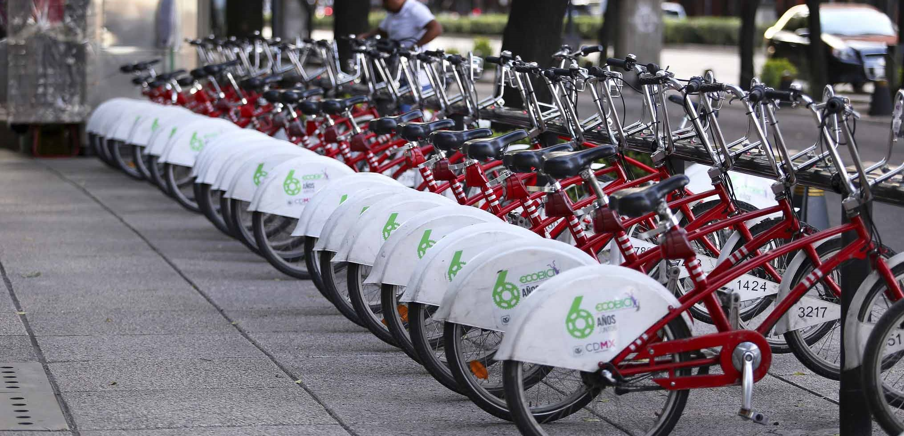

# 📁 **Project : BikeSharingSystem**

#

Este proyecto desarrolla un pipeline de datos orientado al análisis de la movilidad urbana a partir de los viajes del sistema Ecobici en la Ciudad de México. Su objetivo principal es transformar datos crudos en información estructurada y útil para análisis avanzados. El proceso comienza con la extracción de datos de viajes en formato CSV, los cuales contienen información sobre estaciones de origen y destino.
Posteriormente, se realiza una etapa de transformación para limpiar, normalizar y preparar los datos para carga en MySQL.

# Ejecución del proyecto

- Descargar el proyecto en local : **Desktop** <break> 
- Crear un ambiente virtual  <break>
- Intalar dependencias <break> 
- Activar el ambiente virtual <break> 

 
# Estructura del Proyecto

El proyecto está estructurado de la siguiente manera:

    ecobicis_pipeline/
    │
    ├── config/
    │   └── config.yaml
    │
    ├── data/
    │   ├── logs/                      # historial de descargas
    │   ├── creacion_tabla.sql/        # creación de tabla en SQL
    │
    ├── logs/
    │   └── pipeline_log.txt
    │
    ├── notebooks/
    │   └── analysis.ipynb        # exploración y análisis
    │
    ├── figures/                      # (si usas SQL auxiliar)
    │   └── fig01.png
    │
    ├── src/
    │   ├── database/
    │   │   ├── neo4j_connection.py
    │   │   └── mysql_connection.py   
    │   │
    │   ├── ingestion/
    │   │   ├── scraper.py.py   # descarga de la página web
    │   │   └── downloader.py
    │   │
    │   ├── tracking/
    │   │   └── file_tracker.py
    │   │
    │   ├── transformation/
    │   │   └── cleaner.py    
    │   │
    │   ├── utils/
    │   │   └── getFilenames.py
    │   │
    │   └── pipeline.py
    │       └── run_pipeline.py
    │
    ├── dags/                     # (opcional Airflow)
    │   └── ecobicis_dag.py
    │
    ├── main.py
    ├── Dockerfile
    ├── requirements.txt
    └── README.md

 # 1.- Intalación de Python y otras dependencias
 
 - Descargar Python **versión 3.12.0** e instalarlo:  `https://www.python.org/downloads/` <break> 
 - Descargar e instalar VSCode :  `https://code.visualstudio.com/ ` (Opcional)<break>
 - Descargar e instalar Git : `https://git-scm.com/downloads` <break>
 - Descargar e instalar MySQL : `https://git-scm.com/downloads` <break>
 - Descargar e instalar Docker : `https://git-scm.com/downloads` <break>

# 2.- Clonar el proyecto a una carpeta en escritorio
 
- Crear una carpeta en escritorio p.e. "BikeSharingSystem" <break> 
- Click derecho en cualquier lugar dentro de la carpeta y seleccionar **"Git Bash Here"** <break> 
- En la consola de Git ingtroducir siguiente comandos: <break> 
  - `git init` <break> 
  - `git clone https://github.com/JulioCesarMS/BikeSharingSystem` <break>
  - Esperar unos minutos a que descargue los archivos en la carpeta
  

# 3.- Creación de ambiente virtual

 El primer paso es ingresar al directorio (carpeta que contiene los archivos)
  - En la barra inferior de inicio de windows teclear `cmd` en el ícono **buscar**.
  - Después teclearlos siguientes comandos:
    `cd Desktop`  y enter <break>
 
    `cd BikeSharingSystem` y enter <break>
 
     **Observación**
 
     Otra opción es introducir la ruta completa, p.e. `cd Desktop/BikeSharingSystem`. Note la dirección del ícono slash `/`, si copia la ruta desde la carpeta compruebe que sea la correcta en caso contrario realizar la sustitución manualmente.
Una vez que el directorio de la consola se encuentre dentro de la carpeta ejecutar los siguientes comandos, uno a la vez,  en consola (cmd para windown o bien en terminal de linux) 
 

# Fuentes de consulta
