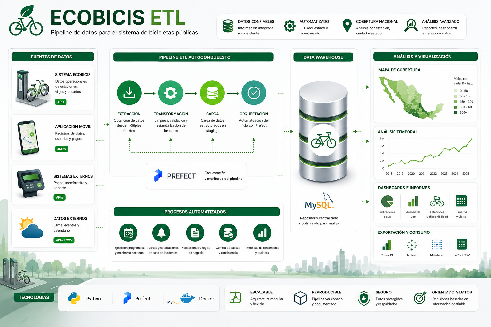
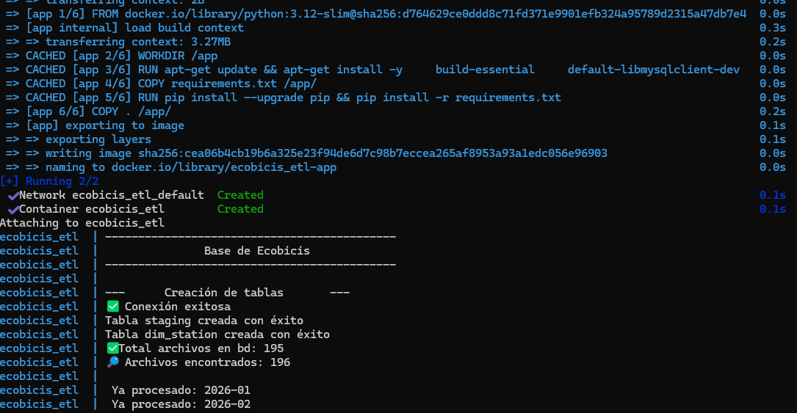
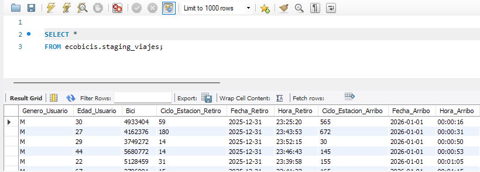

[](https://skillicons.dev)


#


# 🚲 **BikeSharingSystem**
Descripción

ECOBICIS ETL es un proyecto de ingeniería de datos desarrollado en Python para la extracción, transformación y carga (ETL) de información del sistema de bicicletas públicas ECOBICI.

El proyecto integra datos operacionales provenientes de  [datos-abiertos](https://ecobici.cdmx.gob.mx/en/open-data/) para construir un Schema en MySQL.

La solución automatiza el procesamiento de información relacionada con viajes, estaciones y usuarios, permitiendo generar indicadores analíticos optimizados para herramientas de Business Intelligence como Power BI, Tableau, Metabase o Apache Superset.

Objetivos
- Automatizar la extracción de información del sistema ECOBICI.
- Integrar datos históricos de viajes, estaciones y usuarios.
- Implementar un proceso ETL reproducible y escalable.
- Construir un modelo dimensional para análisis estadístico y visualización.
- Facilitar el análisis espacial y temporal de la movilidad urbana.


# Requerimientos:
- [Python 3.12.0](https://www.python.org/)
- [MySQL](https://dev.mysql.com/downloads/workbench/)
- [Git](https://git-scm.com/)
- [Docker](https://www.docker.com/)
- [VScode](https://code.visualstudio.com/)


# Flujo 
- Extracción de archivos históricos.
- Transformación y limpieza de datos.
- Carga en tablas staging.
- Actualización de dimensiones.
- Poblamiento de la tabla de hechos.
- Actualización incremental mediante claves únicas.


 
# Estructura del Proyecto

El proyecto está estructurado de la siguiente manera:

    ecobicis_pipeline/
    │
    ├── config/
    │   └── settings.py
    ├── dags/
    │   └── seco_dags.py
    ├── data/
    │   ├── logs/                      # historial de descargas
    │   ├── raw/                       # datos en crudo
    ├── docs/                          # documentación del projecto en markdown
    ├── figures/                       # imagenes 
    ├── notebooks/                     # notebooks del projecto
    ├── sql/                           # archivos .sql 
    ├── src/
    │   ├── database/
    │   │   ├── create_staging.py
    │   │   ├── create_star_model.py
    │   │   ├── tables.py
    │   │   └── mysql_connection.py   
    │   ├── extraction/
    │   │   ├── downloader.py          # descarga de la información
    │   │   └── scraper.py             # para extraer información  de la página web
    │   ├── load/                      # carga de información
    │   │   ├── loader.py              # dcarga de información a MySQL
    │   │   └── file_tracker.py
    │   ├── transformation/            # transformación de los datos
    │   │   └── cleaner.py             # transformación y limpieza de los datos 
    │   ├── utils/                     # funciones auxiliares
    │   │
    │   └── pipeline/                  # pipeline para ejecutar todo el proceso
    │       └── run_pipeline.py
    │
    ├── .env                              # Variables de entorno
    ├── .gitignore                        # Evitar subir al repositorio archivos no deseados
    ├── main.py                           # Punto de entrada principal del proyecto
    ├── Dockerfile                        # Imagen Docker de la aplicación
    ├── Docke-compose.yml                 # Orquestación de contenedores Docker
    ├── Readme.md                         # Documentación principal
    └── requirements.txt                  # Dependencias Python


 
 # Intalación de Python y otras dependencias
  
 Descargar e instalas todas herramientas en requerimientos.
 
 # Clonar el proyecto a una carpeta en escritorio
  
 - Crear una carpeta en escritorio p.e. "delitos_etl" <break> 
 - Click derecho en cualquier lugar dentro de la carpeta y seleccionar **"Git Bash Here"** <break> 
 - En la consola de Git ingtroducir siguiente comandos: <break> 
   ```bash
   git clone https://github.com/JulioCesarMS/BikeSharingSystem.git
 
   cd ecobicis_etl
   ```
   - Esperar unos minutos a que descargue los archivos en la carpeta
   
 
 # Crear archivo `.env`
 
 Crear en MySQL una conexión, con usuario, y contraseña, posteriormente una base llamada "delitos". Con esa información  crear un archivo `.env` en la raíz del proyecto:
 
 ```env
 DB_HOST=host.docker.internal
 DB_PORT=3306
 DB_NAME=delitos
 DB_USER= usuario raíz en MySQL
 DB_PASSWORD= contraseña para acceder a la conexión en MySQL
 ```
  
 # Creación de ambiente virtual
 
  Es recomendable crear un ambiente virtual para fijar la versión de python, así como las dependencias instaladas.
 
 Crear entorno virtual:
 
 ```bash
 python -m venv venv
 ```
 
 Activar entorno:
 
 En Windows
 
 ```bash
 venv\Scripts\activate
 ```
 
 
 # Construir y ejecutar Docker
 
 Ejecutar el siguiente comando:
 
 ```bash
 docker compose up --build
 ```
 
 
 
 Este comando:
 - Construye la imagen Docker
 - Levanta el contenedor
 - Ejecuta automáticamente el pipeline principal
 
 para detener el contenedor:
 ```bash
 docker compose down
 ```
 
 ver logs del contenedor: 
 ```bash
 docker compose logs -f
 ```
 
 # Orquestación con Prefect
 
 El proyecto utiliza Prefect para automatizar la ejecución de pipelines.
 
 Ejecutar deployment:
 
 ```bash
 python orchestration/deploy.py
 ```
 
 
 # Consultas
 
 Una vez cargada la información se pueden realizar consultas
 
 
 
 
 
 

 
 
 